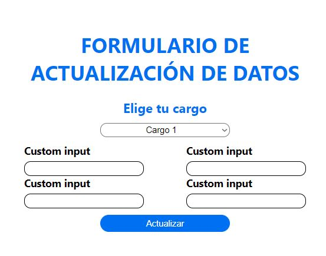
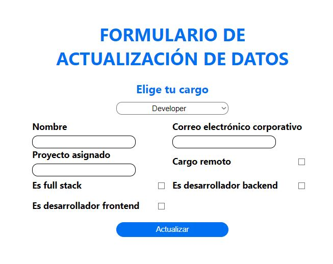
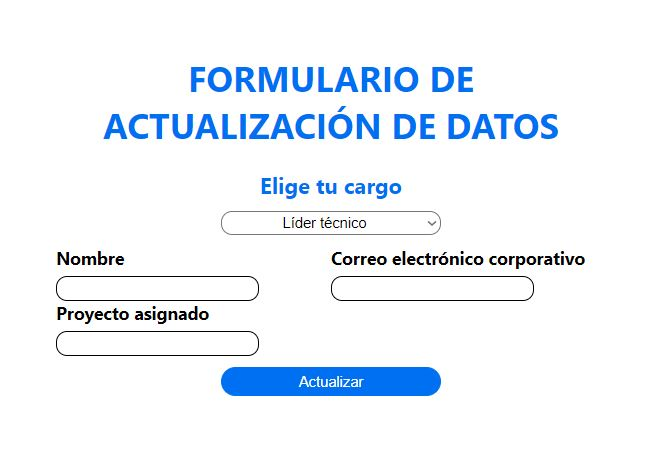
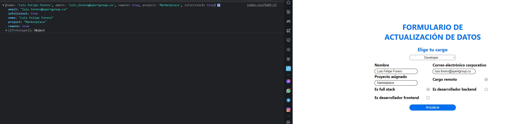

# APLICACIÓN PARA ACTUALIZACIÓN DE DATOS

## Contexto

La empresa Enterprice Develop está desarrollando un formulario de actualización de datos que le permitirá al
área administrativa tener claridad sobre el estado de sus colaboradores. El reto que tiene el equipo de desarrollo
es construir un formulario dinámico, ya que dependiendo del área y el cargo, la información que se deberá almacenar
es diferente.

El desarrollador que estaba trabajando en el proyecto salió a vacaciones, por lo que hay un código base existente.

## Historia de usuario

Como analista de negocios de Enterprice Develop

Quiero contar con un formulario dinámico

Para poder almacenar el estado de los trabajadores dependiendo de su cargo

## Criterios de aceptación

- Debido a que la empresa trabaja con env branching, el desarrollo no se deberá hacer en la rama principal (main),sino que se deberá crear una nueva con el nombre feature/sprint-2/0105.
- El formulario debe contar con una lista desplegable que muestre el nombre de los diferentes cargos de la empresa.
- Dependiendo del cargo elegido por el usuario, el formulario debe mostrar los campos correspondientes.
- Las opciones de la lista desplegable y los campos deben coincidir con la información retornada por el api de la empresa.
- El desarrollo deberá alojarse en GitHub o GitLab (cree un nuevo repositorio público en su cuenta).
- La página no se deberá recargar si el usuario hace clic en el botón "Actualizar".
- La información del formulario se deberá mostrar por consola cuando el usuario de clic en el botón "Actualizar".
- La información para contruir el formulario debe ser consultada en la api de la empresa: https://my-json-server.typicode.com/luisforerop/type-of-positions/db.

## Información adicional

El código que se ha escrito hasta el momento usa:

- React API context
- Hooks custom
- Componentes custom
- TypeScript

Para tener en cuenta:

- Toda la información se deberá cargar en el contexto principal debido a que se espera crear una vista resumen que le muestre al usuario sus respuestas, y para ello, este componente accederá a la información del context.
- Para hacer que el código sea escalable, las responsabilidades se han separado en diferentes componentes y hooks.
- El hook useGetDynamicInputs tiene la responsabilidad de consultar el servicio y almacenar la respuesta que obtenga en el contexto global.
- Los tipos o interfaces que se deban crear se deberán almacenar en la carpeta models.

## A la hora de desarrollar

- Este proyecto está desarrollado usando Next.
- Para levantar el servidor de desarrollo ejecute el comando `npm run dev`.
- Reviser los valores que retorna la API le podría ser de ayudar.
- En la rama helper podrá encontrar una versión de este archivo con tareas sugeridas para el desarrollo. de la prueba.

## Estado del proyecto y resultados esperados

El proyecto está en desarrollo, y el estado actual se pueden apreciar en la siguiente imagen:

Una vez finalizada la prueba técnica esperamos obtener los siguientes resultados:

Si desea y dispone de tiempo suficiente puede crear una segunda vista en la que muestre el resumen de la información
que se ha almacenado en el contexto, es decir, una página en donde se puedan apreciar las respuestas del usuario.

La prueba será revisada en su repositorio de GitHub. Tenga en cuenta el plazo máximo de entrega, el cuál estará descrito
en el mail en el cual recibió esta prueba. Envíe un correo notificando la finalización de la prueba a 
[luis.forero@xpertgroup.co](mailto:luis.forero@xpertgroup.co). Cualquier duda puede enviar un mensaje al mismo correo.
